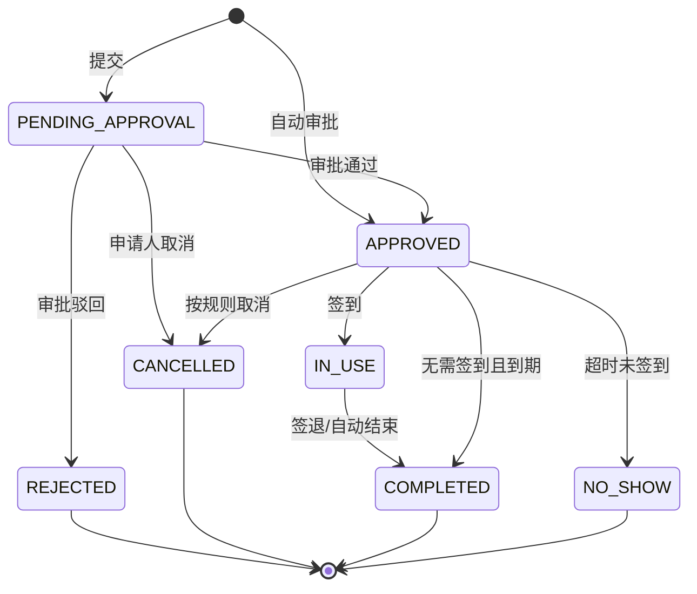
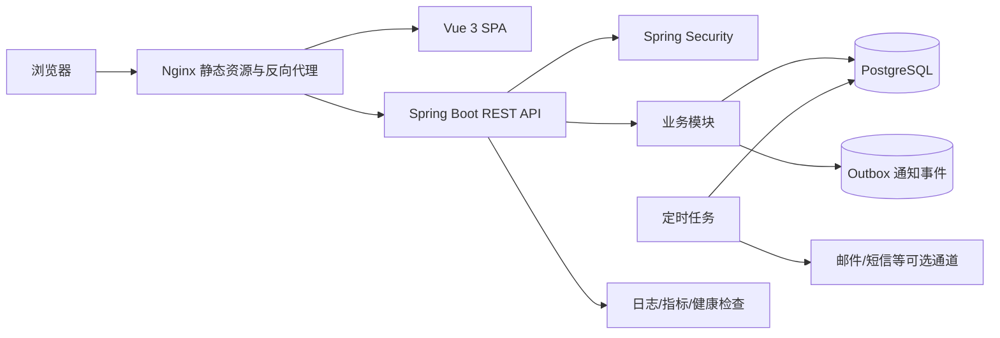
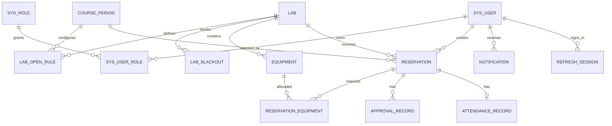

# 计算机学院实验室预约管理系统开发文档

> 技术栈：Spring Boot 3 + Vue 3 + PostgreSQL  
> 文档版本：1.1（课程设计适配版）  
> 编写日期：2026-09-03  
> 适用对象：产品负责人、项目经理、前后端开发、测试、运维及验收人员

---

## 1. 文档目的

本文档给出计算机学院实验室预约管理系统从需求、架构、数据库、接口、前端页面到测试部署的完整实施方案，可作为项目立项、毕业设计、团队协作和验收的统一依据。

系统采用前后端分离的模块化单体架构。第一阶段优先保证预约规则、审批流程、并发冲突、权限控制和审计追踪的正确性；当访问量或组织规模扩大后，可将通知、统计等模块独立部署。

### 1.1 建设目标

- 统一管理实验室、设备、每日四节大课时段和停用安排。
- 支持教师、学生按“日期 + 大课课次”查询并提交预约。
- 支持实验室管理员审批、签到、签退、爽约和违规处理。
- 杜绝同一实验室同一日期、同一大课课次出现多条已生效预约。
- 提供利用率、预约量、取消率、爽约率等统计数据。
- 保留关键操作审计记录，满足学院管理和责任追溯要求。

### 1.2 大四课程设计实施范围

为保证能够在课程设计周期内完成，建议按“核心必做 + 加分扩展”分级实施。

核心必做功能：

- 学生、教师、管理员登录和角色权限控制。
- 四节大课的作息配置与展示。
- 实验室信息、开放课次和停用课次管理。
- 学生预约、教师预约、我的预约和预约详情。
- 管理员审批、驳回和取消。
- 同一实验室同一日期同一课次的冲突校验。
- 按日期和课次查询空闲实验室。
- 按学生/教师分类的预约数量与实验室利用率统计。

加分扩展功能：

- 设备预约与数量并发控制。
- 签到、签退、爽约和违规冻结。
- 站内通知、邮件通知和 Outbox 重试。
- Excel/CSV 导入导出、统一身份认证、二维码签到。
- Docker 部署、接口限流、监控告警和自动化端到端测试。

若时间有限，应先完整实现核心闭环，不要因为扩展功能导致预约冲突、权限或审批主流程不可用。

### 1.3 范围假设

本方案默认：

- 学院内用户由管理员导入，也可后续接入统一身份认证。
- 预约申请人只分为学生和教师两类；管理员只负责管理，不作为预约人员类别。
- 每天固定四节大课，预约粒度是一整节大课，不允许自行输入任意起止时间。
- 四节大课的具体上下课时间由系统管理员配置，本文示例时间需要按本校作息表调整。
- 教师和学生均可发起预约；是否允许学生预约、两类人员是否需要审批由实验室规则分别控制。
- 每次预约独占某实验室的一个大课课次，可同时申请若干设备。
- 审批支持“自动通过”和“管理员审批”两种模式。
- 第一版不实现收费、门禁硬件直连和复杂多级会签，仅预留扩展点。
- 系统业务时区为 `Asia/Shanghai`，数据库时间使用 `timestamptz` 保存。

---

## 2. 用户角色与权限

系统采用 RBAC（用户—角色—权限）模型，接口权限与数据范围同时校验。

| 角色 | 主要权限 | 默认数据范围 |
|---|---|---|
| 学生 `STUDENT` | 查看实验室与空闲课次、提交学生预约、取消本人预约、签到签退、查看通知 | 本人数据、公开实验室 |
| 教师 `TEACHER` | 查看空闲课次、提交教师预约、取消本人预约、查看本人教学/科研预约 | 本人及本人项目数据 |
| 实验室管理员 `LAB_ADMIN` | 管理负责实验室、开放规则、停用课次、设备、审批、现场登记、统计 | 被授权实验室 |
| 系统管理员 `SYSTEM_ADMIN` | 用户角色、全部实验室、系统参数、日志、全局统计 | 全院数据 |

### 2.1 建议权限编码

| 权限编码 | 说明 |
|---|---|
| `lab:read` / `lab:write` | 查询/维护实验室 |
| `equipment:read` / `equipment:write` | 查询/维护设备 |
| `reservation:create` | 创建预约 |
| `reservation:read:self` | 查看本人预约 |
| `reservation:read:managed` | 查看管辖实验室预约 |
| `reservation:approve` | 审批或驳回预约 |
| `reservation:cancel:any` | 管理员取消预约 |
| `checkin:manage` | 代签到、签退和异常处理 |
| `statistics:read` | 查看统计 |
| `user:write` / `role:write` | 用户与权限管理 |
| `audit:read` | 查看审计日志 |

> 前端路由权限仅用于改善体验，后端接口必须再次执行角色、权限和数据范围校验。

### 2.2 学生预约与教师预约

| 项目 | 学生预约 | 教师预约 |
|---|---|---|
| 类别编码 | `STUDENT` | `TEACHER` |
| 身份来源 | 当前登录用户的学籍身份 | 当前登录用户的教职工身份 |
| 默认审批 | 人工审批 | 按实验室配置为人工或自动审批 |
| 必填业务信息 | 用途、人数、班级/项目、联系电话 | 用途、人数、课程/科研项目、联系电话 |
| 查询范围 | 本人提交的学生预约 | 本人提交的教师预约 |
| 统计 | 单独统计申请量、通过率、爽约率 | 单独统计申请量、通过率、爽约率 |

预约类别是提交时的身份快照，由后端写入，不能让前端传入并冒充另一类人员。两类预约占用实验室时使用同一冲突规则；教师预约不会覆盖已经生效的学生预约。

---

## 3. 功能需求

### 3.1 登录与个人中心

- 账号密码登录、退出、刷新令牌。
- 首次登录强制修改初始密码。
- 连续失败锁定、验证码（按安全策略启用）、找回密码。
- 查看和修改姓名、手机号、邮箱等非权威资料。
- 查看本人预约、审批结果、签到记录、违规记录和站内通知。

### 3.2 实验室管理

- 实验室基本信息：编号、名称、楼宇、房间、容量、类型、说明、图片、负责人。
- 状态：启用、停用、维护中。
- 预约策略：学生审批模式、教师审批模式、提前预约天数、每人每日最多课次数、取消截止课次/时间、是否允许学生预约。
- 每周开放规则：星期几开放第几节大课、适用日期范围。
- 特殊停用课次：节假日、固定课程占用、维护、考试、临时封闭。
- 标签和能力：操作系统、GPU、网络环境、软件清单、无障碍条件等。

### 3.3 设备管理

- 设备分类、资产编号、名称、型号、总数量、可借数量、状态和所属实验室。
- 预约时按数量申请设备。
- 设备维护、报废和故障期间不可被新预约占用。
- 关键设备可要求用户具备指定资质或培训记录。

### 3.4 空闲查询

用户先选择日期和第 1～4 节大课，再按容量、位置、标签、设备条件筛选实验室。空闲结果应综合：

1. 实验室启用状态；
2. 该星期与课次的常规开放规则；
3. 该日期与课次的特殊停用安排；
4. 已通过和使用中的预约；
5. 设备可用数量；
6. 用户资格和实验室预约策略。

### 3.5 预约管理

预约字段包括预约人员类别（学生/教师）、预约日期、大课课次、用途、参加人数、实验室、设备、课程/项目、联系电话和备注。`applicant_type` 必须由后端根据当前用户生成，客户端不得代填或修改。

#### 3.5.1 四节大课定义

系统维护全校统一的四条课次记录，课程设计演示环境可采用以下初始值，部署时以学校正式作息表为准：

| 课次 | 显示名称 | 示例开始时间 | 示例结束时间 |
|---:|---|---:|---:|
| 1 | 第一大节 | 08:00 | 09:40 |
| 2 | 第二大节 | 10:00 | 11:40 |
| 3 | 第三大节 | 14:00 | 15:40 |
| 4 | 第四大节 | 16:00 | 17:40 |

预约只能选择一条 `course_period`。如需连续使用两节大课，应分别创建两条预约；后续可扩展“一次勾选多个连续课次，后端拆成多条关联预约”。

预约状态机：



主要规则：

- `booking_date` 不得早于当前日期，`period_no` 只能是 1～4。
- 参加人数不得超过实验室容量。
- 预约日期必须满足提前预约天数，所选课次必须在实验室开放规则内。
- 预约不得命中特殊停用课次。
- 审批通过时再次检查房间和设备冲突。
- 同一实验室在同一日期、同一课次只能存在一条生效预约。
- 学生预约和教师预约在资源冲突规则上地位相同，已生效预约不会因人员类别被自动抢占。
- 仅待审批或已通过且未开始的预约可取消；超过取消截止时间需管理员处理并记录原因。
- 已被驳回或取消的预约不可恢复，用户应复制原预约重新提交。
- 所有状态变化必须写入历史或审批记录，禁止直接覆盖而不留痕。

### 3.6 审批管理

- 审批列表按实验室、申请人、学生/教师预约类别、日期、课次和状态筛选。
- 审批人查看申请详情、冲突提示、用户历史违规和设备需求。
- 支持通过、驳回；驳回原因必填。
- 禁止审批本人提交的预约（系统管理员应急处理除外，并写审计日志）。
- 多人同时审批同一条记录时只允许首个有效操作成功。

### 3.7 签到、签退与违规

- 签到窗口默认为预约开始前 15 分钟至开始后 15 分钟，可配置。
- 签到方式第一版支持页面操作和管理员代操作；二维码门牌可作为扩展。
- 预约结束前允许主动签退并记录实际使用情况；核心版仍按整节大课占用，不把剩余分钟重新拆分预约。
- 超过签到宽限期未签到，定时任务将预约标记为 `NO_SHOW`。
- 可按爽约次数冻结用户预约资格，冻结时间和阈值由系统参数控制。

### 3.8 通知

- 站内通知：提交成功、审批结果、预约提醒、取消、临时停用和爽约。
- 邮件/短信/企业微信作为可插拔通道，不影响核心事务提交。
- 通知采用事件表异步投递，失败可重试，避免外部通道故障拖慢预约接口。

### 3.9 统计分析

- 预约总量、通过率、取消率、爽约率。
- 实验室按日/周/月的已预约课次数和利用率。
- 高峰时段、热门实验室、设备使用排行。
- 用户类型、课程/项目维度统计。
- 数据导出为 CSV；大量导出采用异步任务。

利用率建议口径：

```text
实验室利用率 = 统计期内 APPROVED/IN_USE/COMPLETED 的已占用大课课次数
               ÷ 统计期内实验室可开放大课课次数 × 100%
```

每个预约只对应一个日期和一个大课课次；取消、驳回、爽约不计入有效占用课次。统计同时按学生预约、教师预约两个类别分组展示。

---

## 4. 非功能需求

| 类别 | 目标 |
|---|---|
| 可用性 | 核心服务月可用性目标 99.5%，数据库每日备份 |
| 性能 | 常规查询 P95 < 500 ms；预约提交 P95 < 1 s（不含外部通知） |
| 容量 | 初始支持 10,000 用户、200 实验室、并发在线 300 人 |
| 一致性 | 同一实验室同一日期同一大课课次只能有一条生效预约；审批和取消具备幂等性 |
| 安全 | 密码强哈希、最小权限、输入校验、限流、审计、敏感配置外置 |
| 兼容性 | Chrome、Edge 最近两个主要版本，桌面端优先并适配移动端 |
| 可维护性 | 数据库变更版本化；接口 OpenAPI 化；核心规则单元测试覆盖率 ≥ 80% |
| 可观测性 | 健康检查、结构化日志、请求 ID、业务指标和异常告警 |

---

## 5. 技术架构

### 5.1 技术选型

| 层次 | 选型 | 说明 |
|---|---|---|
| 后端 | Java 21、Spring Boot 3.5.x | Java 21 LTS；使用 Spring MVC |
| 安全 | Spring Security、JWT | Access Token + Refresh Token |
| 数据访问 | Spring Data JPA | 普通 CRUD；复杂报表使用原生 SQL |
| 校验 | Jakarta Validation | DTO 参数校验 |
| 数据库迁移 | Flyway | 禁止生产环境依赖自动建表 |
| API 文档 | springdoc-openapi | 输出 OpenAPI 3 文档 |
| 数据库 | PostgreSQL 16+ | 使用部分唯一索引、行锁和事务能力 |
| 前端 | Vue 3、TypeScript、Vite | Composition API + `<script setup>` |
| 前端生态 | Vue Router、Pinia、Axios、Element Plus、ECharts | 路由、状态、请求、组件与图表 |
| 测试 | JUnit 5、Testcontainers、Vitest、Playwright | 单元、集成、组件和端到端测试 |
| 部署 | Docker Compose、Nginx | 单机/校内服务器起步 |

Spring Boot 3.5.x 至少要求 Java 17，本方案统一使用 Java 21。Vue 官方脚手架基于 Vite，Node.js 版本应遵循项目创建时的 Vue 官方要求。版本依据见第 18 节。

### 5.2 总体架构



### 5.3 后端模块边界

推荐采用“按业务功能分包”的模块化单体，避免所有 Controller、Service、Repository 分别堆在三个大目录中。

```text
backend/
├─ pom.xml
└─ src/main/java/com/college/labbooking/
   ├─ LabBookingApplication.java
   ├─ common/          # 响应、异常、分页、审计、时间工具
   ├─ config/          # Security、Jackson、OpenAPI、CORS
   ├─ auth/            # 登录、令牌、会话
   ├─ identity/        # 用户、角色、权限、组织
   ├─ lab/             # 实验室、开放规则、停用课次
   ├─ equipment/       # 设备与设备维护
   ├─ reservation/     # 空闲查询、预约、状态机、审批
   ├─ attendance/      # 签到签退、爽约
   ├─ notification/    # 站内通知和 Outbox 消费
   ├─ statistics/      # 聚合查询与导出
   └─ audit/           # 审计查询
```

每个业务包内部可包含 `web`、`application`、`domain`、`infrastructure` 四层。Controller 只负责协议转换；事务和用例编排放在 application；规则放在 domain；JPA/外部通道放在 infrastructure。

### 5.4 前端目录

```text
frontend/
├─ package.json
├─ vite.config.ts
└─ src/
   ├─ api/             # 按领域封装 HTTP 请求
   ├─ assets/
   ├─ components/      # 通用组件
   ├─ composables/     # usePagination、usePermission 等
   ├─ layouts/         # BasicLayout、AuthLayout
   ├─ router/          # 路由与守卫
   ├─ stores/          # Pinia：auth、permission、notification
   ├─ types/           # API 类型定义
   ├─ utils/           # request、date、download
   └─ views/
      ├─ auth/
      ├─ dashboard/
      ├─ labs/
      ├─ reservations/
      ├─ approvals/
      ├─ equipment/
      ├─ users/
      ├─ statistics/
      └─ audit/
```

---

## 6. 数据库设计

### 6.1 设计约定

- 主键统一使用 `bigint generated by default as identity`。
- 预约业务键使用 `booking_date + period_no`；课次展示时间使用 `time`。
- 登录、审批、审计等事件时间使用 `timestamptz`。
- 表名、字段名使用小写蛇形命名。
- 业务记录保留 `created_at`、`created_by`、`updated_at`、`updated_by`。
- 用户、实验室等主数据使用逻辑停用，不轻易物理删除。
- 状态优先使用 `varchar + CHECK`，便于 Flyway 迁移；规模稳定后可评估 PostgreSQL enum。
- 乐观锁字段 `version` 用于防止表单覆盖；并发预约由数据库约束最终保证。

### 6.2 ER 模型



### 6.3 核心表说明

| 表 | 用途 | 关键字段/约束 |
|---|---|---|
| `sys_user` | 用户 | `username`、学工号唯一；状态、密码版本 |
| `sys_role`、`sys_user_role` | RBAC | 角色编码唯一；用户角色联合唯一 |
| `course_period` | 四节大课定义 | 课次号 1～4、名称、开始/结束时间 |
| `lab` | 实验室 | 编号唯一、容量、学生/教师审批策略、预约限制 |
| `lab_open_rule` | 周开放课次 | 星期、课次、有效日期 |
| `lab_blackout` | 特殊停用 | 实验室、日期、课次、原因 |
| `equipment` | 设备/设备组 | 资产编号、总量、可用状态、实验室 |
| `reservation` | 预约主表 | 日期、课次、学生/教师类别、状态、申请人、用途、版本 |
| `reservation_equipment` | 预约设备 | 设备和数量联合唯一 |
| `approval_record` | 审批历史 | 动作、审批人、意见、前后状态 |
| `attendance_record` | 签到签退 | 签到/签退时间、方式、操作人 |
| `refresh_session` | 刷新会话 | 令牌摘要、过期、撤销时间 |
| `notification` | 站内消息 | 类型、内容、读取时间 |
| `outbox_event` | 异步事件 | 负载、投递状态、重试次数 |
| `audit_log` | 审计日志 | 操作者、动作、对象、请求 ID、结果 |

### 6.4 核心 DDL 示例

以下脚本应保存为 Flyway `V1__init.sql` 的基础，再按项目实际字段补充。固定课次模型可以直接使用部分唯一索引，无需额外扩展。

```sql
create table sys_user (
    id              bigint generated by default as identity primary key,
    username        varchar(64) not null unique,
    password_hash   varchar(255) not null,
    real_name       varchar(64) not null,
    user_type       varchar(20) not null
                    check (user_type in ('STUDENT', 'TEACHER', 'STAFF')),
    department      varchar(100),
    email           varchar(128),
    phone           varchar(32),
    status          varchar(20) not null default 'ACTIVE'
                    check (status in ('ACTIVE', 'DISABLED', 'LOCKED')),
    must_change_password boolean not null default true,
    failed_login_count integer not null default 0,
    locked_until    timestamptz,
    version         bigint not null default 0,
    created_at      timestamptz not null default now(),
    updated_at      timestamptz not null default now()
);

create table sys_role (
    id          bigint generated by default as identity primary key,
    code        varchar(40) not null unique,
    name        varchar(80) not null,
    permissions jsonb not null default '[]'::jsonb
);

create table sys_user_role (
    user_id bigint not null references sys_user(id),
    role_id bigint not null references sys_role(id),
    primary key (user_id, role_id)
);

create table course_period (
    period_no  smallint primary key check (period_no between 1 and 4),
    name       varchar(40) not null,
    start_time time not null,
    end_time   time not null,
    enabled    boolean not null default true,
    check (start_time < end_time)
);

-- 演示初始值；上线时按学校正式作息表调整。
insert into course_period(period_no, name, start_time, end_time) values
    (1, '第一大节', '08:00', '09:40'),
    (2, '第二大节', '10:00', '11:40'),
    (3, '第三大节', '14:00', '15:40'),
    (4, '第四大节', '16:00', '17:40');

create table lab (
    id                    bigint generated by default as identity primary key,
    code                  varchar(40) not null unique,
    name                  varchar(100) not null,
    building              varchar(100) not null,
    room_no               varchar(40) not null,
    capacity              integer not null check (capacity > 0),
    status                varchar(20) not null default 'ACTIVE'
                          check (status in ('ACTIVE', 'DISABLED', 'MAINTENANCE')),
    student_approval_mode varchar(20) not null default 'MANUAL'
                          check (student_approval_mode in ('AUTO', 'MANUAL')),
    teacher_approval_mode varchar(20) not null default 'MANUAL'
                          check (teacher_approval_mode in ('AUTO', 'MANUAL')),
    allow_student_booking boolean not null default true,
    max_periods_per_user_day integer not null default 2
                          check (max_periods_per_user_day between 1 and 4),
    advance_days          integer not null default 14 check (advance_days >= 0),
    cancel_before_minutes integer not null default 120 check (cancel_before_minutes >= 0),
    description           text,
    version               bigint not null default 0,
    created_at            timestamptz not null default now(),
    updated_at            timestamptz not null default now(),
    unique (building, room_no)
);

create table lab_open_rule (
    id          bigint generated by default as identity primary key,
    lab_id      bigint not null references lab(id),
    day_of_week smallint not null check (day_of_week between 1 and 7),
    period_no   smallint not null references course_period(period_no),
    valid_from  date,
    valid_to    date,
    check (valid_to is null or valid_from is null or valid_from <= valid_to),
    unique (lab_id, day_of_week, period_no, valid_from)
);

create table lab_blackout (
    id          bigint generated by default as identity primary key,
    lab_id      bigint not null references lab(id),
    booking_date date not null,
    period_no   smallint not null references course_period(period_no),
    reason      varchar(255) not null,
    created_by  bigint not null references sys_user(id),
    created_at  timestamptz not null default now(),
    unique (lab_id, booking_date, period_no)
);

create table equipment (
    id              bigint generated by default as identity primary key,
    lab_id          bigint references lab(id),
    asset_code      varchar(64) unique,
    name            varchar(100) not null,
    model           varchar(100),
    total_quantity  integer not null default 1 check (total_quantity > 0),
    status          varchar(20) not null default 'AVAILABLE'
                    check (status in ('AVAILABLE', 'MAINTENANCE', 'RETIRED')),
    version         bigint not null default 0,
    created_at      timestamptz not null default now(),
    updated_at      timestamptz not null default now()
);

create table reservation (
    id              bigint generated by default as identity primary key,
    reservation_no  varchar(32) not null unique,
    applicant_id    bigint not null references sys_user(id),
    applicant_type  varchar(16) not null
                    check (applicant_type in ('STUDENT', 'TEACHER')),
    lab_id          bigint not null references lab(id),
    title           varchar(120) not null,
    purpose         text not null,
    participant_count integer not null check (participant_count > 0),
    booking_date    date not null,
    period_no       smallint not null references course_period(period_no),
    status          varchar(24) not null,
    contact_phone   varchar(32),
    project_or_course varchar(120),
    remark          text,
    cancellation_reason text,
    approved_by     bigint references sys_user(id),
    approved_at     timestamptz,
    version         bigint not null default 0,
    created_at      timestamptz not null default now(),
    updated_at      timestamptz not null default now(),
    check (status in (
        'PENDING_APPROVAL', 'APPROVED', 'REJECTED', 'CANCELLED',
        'IN_USE', 'COMPLETED', 'NO_SHOW'
    ))
);

-- 同一实验室、日期和课次只能有一条生效预约；待审批记录可以并存。
create unique index uk_reservation_active_slot
    on reservation(lab_id, booking_date, period_no)
    where status in ('APPROVED', 'IN_USE');

create table reservation_equipment (
    reservation_id bigint not null references reservation(id) on delete cascade,
    equipment_id   bigint not null references equipment(id),
    quantity       integer not null check (quantity > 0),
    primary key (reservation_id, equipment_id)
);

create table approval_record (
    id              bigint generated by default as identity primary key,
    reservation_id  bigint not null references reservation(id),
    approver_id     bigint not null references sys_user(id),
    action          varchar(20) not null check (action in ('APPROVE', 'REJECT', 'ADMIN_CANCEL')),
    from_status     varchar(24) not null,
    to_status       varchar(24) not null,
    comment         text,
    created_at      timestamptz not null default now()
);

create table attendance_record (
    id              bigint generated by default as identity primary key,
    reservation_id  bigint not null unique references reservation(id),
    check_in_at     timestamptz,
    check_out_at    timestamptz,
    check_in_method varchar(20),
    operated_by     bigint references sys_user(id),
    check (check_out_at is null or check_in_at is null or check_in_at <= check_out_at)
);

create index idx_reservation_applicant_created
    on reservation(applicant_id, created_at desc);
create index idx_reservation_lab_date_period
    on reservation(lab_id, booking_date, period_no);
create index idx_reservation_status_date
    on reservation(status, booking_date);
create index idx_reservation_type_date
    on reservation(applicant_type, booking_date);
create index idx_blackout_lab_date_period
    on lab_blackout(lab_id, booking_date, period_no);
```

### 6.5 冲突与事务策略

#### 实验室冲突

审批或自动通过应在单个数据库事务内完成：

1. 使用 `SELECT ... FOR UPDATE` 锁定预约记录。
2. 校验当前状态仍为 `PENDING_APPROVAL`。
3. 重新读取实验室、开放规则、停用课次和容量。
4. 查询相同 `lab_id + booking_date + period_no` 的生效预约。
5. 校验设备余量。
6. 更新为 `APPROVED` 并写审批历史、Outbox 事件。
7. 提交事务；若触发部分唯一索引，将数据库异常转换为 `RESERVATION_SLOT_CONFLICT`。

部分唯一索引是最终防线，业务层预检查用于返回更友好的错误提示。多个待审批预约可以选择同一课次，但只能有一个被批准；如果课程要求“提交即占位”，可把 `PENDING_APPROVAL` 加入索引条件。

#### 设备数量冲突

设备是“数量资源”，不能只依赖普通唯一约束。审批时按 `equipment_id` 升序锁定涉及的设备行，再汇总同一日期、同一课次生效预约的占用数量：

```text
可用数量 = total_quantity - 同日期同课次生效预约已分配数量
```

统一升序加锁可减少死锁；不足时整个事务回滚。若设备按单件资产管理，建议每件设备独立一行，并为其增加 `(equipment_id, booking_date, period_no)` 部分唯一索引。

---

## 7. REST API 设计

### 7.1 通用规范

- 基础路径：`/api/v1`
- 请求/响应：`application/json; charset=utf-8`
- 预约日期格式：`yyyy-MM-dd`；审批、签到等事件时间使用 ISO 8601，如 `2026-09-10T08:30:00+08:00`。
- 分页参数：`page` 从 0 开始，`size` 默认 20，最大 100。
- 写接口支持 `X-Idempotency-Key`；预约提交、审批和取消必须幂等。
- 每个响应返回 `X-Request-Id`，日志和审计使用相同请求 ID。

统一成功响应：

```json
{
  "code": "OK",
  "message": "success",
  "data": {},
  "requestId": "01J7EXAMPLE",
  "timestamp": "2026-09-03T10:20:30+08:00"
}
```

统一错误响应：

```json
{
  "code": "RESERVATION_SLOT_CONFLICT",
  "message": "该实验室在所选日期和大课课次已被占用",
  "details": [{ "field": "periodNo", "reason": "conflict" }],
  "requestId": "01J7EXAMPLE",
  "timestamp": "2026-09-03T10:20:30+08:00"
}
```

主要 HTTP 状态：`400` 参数错误、`401` 未登录、`403` 无权限、`404` 不存在、`409` 冲突/状态已变化、`422` 业务规则不满足、`429` 请求过多、`500` 未知错误。

### 7.2 认证接口

| 方法 | 路径 | 说明 |
|---|---|---|
| POST | `/auth/login` | 登录，返回访问令牌与刷新令牌 |
| POST | `/auth/refresh` | 轮换刷新令牌 |
| POST | `/auth/logout` | 撤销当前刷新会话 |
| GET | `/auth/me` | 当前用户、角色、权限 |
| PUT | `/auth/password` | 修改密码并撤销其他会话 |

登录请求：

```json
{ "username": "20260001", "password": "********" }
```

### 7.3 实验室与空闲查询

| 方法 | 路径 | 权限 | 说明 |
|---|---|---|---|
| GET | `/labs` | 登录用户 | 分页检索实验室 |
| GET | `/labs/{id}` | 登录用户 | 实验室详情与预约策略 |
| POST | `/labs` | `lab:write` | 新增实验室 |
| PUT | `/labs/{id}` | `lab:write` | 更新实验室，携带 `version` |
| GET | `/labs/{id}/open-rules` | 登录用户 | 开放规则 |
| PUT | `/labs/{id}/open-rules` | `lab:write` | 批量替换开放规则 |
| GET | `/labs/{id}/blackouts` | 登录用户 | 停用课次 |
| POST | `/labs/{id}/blackouts` | `lab:write` | 新增停用课次 |
| GET | `/course-periods` | 登录用户 | 查询每天四节大课及显示时间 |
| GET | `/availability/labs` | 登录用户 | 查询满足日期、课次、容量、设备条件的实验室 |
| GET | `/labs/{id}/calendar` | 登录用户 | 日/周预约日历 |

空闲查询示例：

```http
GET /api/v1/availability/labs?bookingDate=2026-09-10&periodNo=1&capacity=30&equipmentIds=12,15
```

### 7.4 预约接口

| 方法 | 路径 | 说明 |
|---|---|---|
| POST | `/reservations` | 提交预约 |
| GET | `/reservations/my` | 本人的预约列表 |
| GET | `/reservations/{id}` | 预约详情，执行数据范围校验 |
| POST | `/reservations/{id}/cancel` | 取消预约 |
| POST | `/reservations/{id}/check-in` | 签到 |
| POST | `/reservations/{id}/check-out` | 签退 |

创建请求：

```json
{
  "labId": 8,
  "title": "机器学习课程实验",
  "purpose": "完成神经网络模型训练实验",
  "participantCount": 28,
  "bookingDate": "2026-09-10",
  "periodNo": 1,
  "projectOrCourse": "机器学习 2026 秋",
  "contactPhone": "13800000000",
  "equipmentItems": [
    { "equipmentId": 12, "quantity": 2 }
  ],
  "remark": "需要预装指定数据集"
}
```

请求中不接收 `applicantType`，服务端根据当前登录用户生成 `STUDENT` 或 `TEACHER`。返回值必须明确 `applicantType`、`status` 和 `nextAction`。对应人员类别为自动审批时可直接返回 `APPROVED`；人工审批返回 `PENDING_APPROVAL`。

### 7.5 审批与管理接口

| 方法 | 路径 | 说明 |
|---|---|---|
| GET | `/admin/reservations` | 管辖范围内预约列表 |
| POST | `/admin/reservations/{id}/approve` | 审批通过 |
| POST | `/admin/reservations/{id}/reject` | 驳回，原因必填 |
| POST | `/admin/reservations/{id}/cancel` | 管理员取消，原因必填 |
| GET | `/admin/reservations/{id}/history` | 状态和审批历史 |
| POST | `/admin/reservations/{id}/check-in` | 管理员代签到 |
| POST | `/admin/reservations/{id}/check-out` | 管理员代签退 |

审批请求带版本号，避免处理过期页面：

```json
{ "version": 3, "comment": "用途与所选课次符合规定" }
```

### 7.6 用户、设备、通知和统计

| 模块 | 典型接口 |
|---|---|
| 用户 | `GET/POST /admin/users`、`PUT /admin/users/{id}`、`PUT /admin/users/{id}/roles` |
| 批量导入 | `POST /admin/users/import`、`GET /admin/import-tasks/{id}` |
| 设备 | `GET/POST /equipment`、`PUT /equipment/{id}` |
| 通知 | `GET /notifications`、`PUT /notifications/{id}/read`、`PUT /notifications/read-all` |
| 统计 | `GET /statistics/overview`、`/statistics/lab-usage`、`/statistics/peak-hours` |
| 审计 | `GET /admin/audit-logs` |

---

## 8. 后端详细设计

### 8.1 关键用例服务

```java
public interface ReservationApplicationService {
    ReservationView create(CreateReservationCommand command, CurrentUser user);
    ReservationView approve(long reservationId, long expectedVersion,
                            String comment, CurrentUser approver);
    ReservationView reject(long reservationId, long expectedVersion,
                           String reason, CurrentUser approver);
    ReservationView cancel(long reservationId, long expectedVersion,
                           String reason, CurrentUser operator);
}
```

`create` 的推荐处理顺序：

1. Bean Validation 校验格式。
2. 验证用户状态与预约资格。
3. 读取实验室规则并验证人员类别、日期、课次、容量、开放课次和停用课次。
4. 验证设备归属、状态和申请数量。
5. 人工审批模式保存为 `PENDING_APPROVAL`；自动模式执行完整冲突事务并保存为 `APPROVED`。
6. 写入预约设备和 Outbox 事件。
7. 返回预约编号、状态及下一步动作。

### 8.2 状态机约束

状态转换必须集中在领域对象或专用状态机服务中，不允许 Controller 直接修改状态。

```text
PENDING_APPROVAL -> APPROVED | REJECTED | CANCELLED
APPROVED         -> IN_USE | CANCELLED | NO_SHOW | COMPLETED
IN_USE           -> COMPLETED
```

任何不在白名单中的转换返回 `RESERVATION_STATUS_INVALID`。定时任务与人工操作使用同一状态转换服务。

### 8.3 异常处理

- 使用 `@RestControllerAdvice` 统一映射异常。
- `MethodArgumentNotValidException` 映射字段级错误。
- JPA 乐观锁异常映射 `409 RESOURCE_VERSION_CONFLICT`。
- PostgreSQL 部分唯一索引冲突映射 `409 RESERVATION_SLOT_CONFLICT`。
- 未知异常不向客户端返回堆栈、SQL、表名或服务器路径。
- 日志保存完整异常，并关联 `requestId`、用户 ID 和接口。

### 8.4 定时任务

| 任务 | 建议频率 | 行为 |
|---|---|---|
| 预约提醒 | 每 5 分钟 | 为 24 小时/1 小时内预约创建通知事件 |
| 爽约处理 | 每 1 分钟 | 超过签到宽限期的 `APPROVED` 标记 `NO_SHOW` |
| 自动完成 | 每 5 分钟 | 到期且无需人工签退的预约标记 `COMPLETED` |
| Outbox 投递 | 每 10 秒 | 批量领取待发事件、重试并记录结果 |
| 会话清理 | 每日 | 删除过期且已撤销的刷新会话 |

多实例部署时，通过 PostgreSQL advisory lock 或任务锁确保同一批任务不重复执行；状态更新仍需以条件更新保证幂等。

### 8.5 缓存策略

第一版不强制引入 Redis。实验室详情、开放规则可使用短时本地缓存，但预约可用性和审批不得只依赖缓存判断。访问量提升后可引入 Redis 缓存只读数据、限流计数和短期验证码。

---

## 9. 前端详细设计

### 9.1 页面与路由

| 路由 | 页面 | 访问角色 |
|---|---|---|
| `/login` | 登录 | 公开 |
| `/dashboard` | 首页概览、近期预约、提醒 | 全部登录用户 |
| `/labs` | 实验室检索与空闲查询 | 全部登录用户 |
| `/labs/:id` | 实验室详情和日历 | 全部登录用户 |
| `/reservations/new` | 创建预约 | 学生、教师、管理员 |
| `/reservations/my` | 我的预约 | 全部登录用户 |
| `/reservations/:id` | 预约详情 | 有数据权限者 |
| `/approvals` | 待审批/历史审批 | 实验室管理员、系统管理员 |
| `/manage/labs` | 实验室与规则管理 | 管理员 |
| `/manage/equipment` | 设备管理 | 管理员 |
| `/manage/users` | 用户角色管理 | 系统管理员 |
| `/statistics` | 统计分析 | 管理员 |
| `/audit` | 审计日志 | 系统管理员 |

### 9.2 创建预约交互

建议使用四步表单：

1. 选择预约日期、第 1～4 节大课之一和人数；
2. 从可用结果中选择实验室；
3. 选择设备并填写用途、课程/项目和联系方式；
4. 展示规则摘要、取消截止时间，确认提交。

页面顶部应明确显示当前为“学生预约”或“教师预约”，但不提供手动切换入口。前端做即时校验，提交后以后端结果为准。遇到 `409` 冲突时保留已填信息，回到实验室选择步骤并刷新可用列表。

### 9.3 请求与状态管理

- Axios 实例统一注入 Access Token、`X-Request-Id` 和时区信息。
- 收到 `401` 时只允许一个刷新请求执行，其余请求等待；刷新失败统一退出。
- Pinia 仅保存会话用户、权限和少量跨页面状态；业务列表不长期缓存。
- Access Token 优先保存在内存；Refresh Token 使用 `HttpOnly + Secure + SameSite` Cookie。
- 前端统一处理 `code`，不通过解析中文 `message` 决定逻辑。
- 所有提交按钮在请求期间禁用，配合幂等键防止重复提交。

### 9.4 可用性与无障碍

- 状态不仅用颜色区分，同时显示文字/图标。
- 表单错误与字段关联，键盘可完成主要操作。
- 日历同时提供列表视图，移动端默认列表视图。
- 危险操作二次确认，并明确影响对象和不可逆后果。
- 页面同时显示“第几大节”和对应起止时间，例如“第一大节（08:00–09:40）”。

---

## 10. 安全设计

### 10.1 身份与会话

- 密码使用 Spring Security `PasswordEncoder` 的自适应强哈希实现，不保存明文或可逆密文。
- Access Token 建议 15 分钟有效；Refresh Token 建议 7 天有效并每次刷新轮换。
- 数据库只保存 Refresh Token 摘要；退出、改密、禁用用户时撤销对应会话。
- JWT 至少包含 `sub`、`jti`、`iat`、`exp`，角色权限可从服务端加载，避免长令牌权限滞后。
- 管理员账号建议启用更严格的密码策略和二次认证扩展。

### 10.2 Web 安全

- 明确配置 CORS 白名单，生产环境禁止 `*` 搭配凭据。
- 使用 Cookie 刷新令牌时启用 CSRF 防护或双提交令牌策略。
- 使用 ORM 参数绑定，禁止字符串拼接 SQL。
- 富文本按白名单清洗；普通字段输出时默认转义。
- 登录、刷新、空闲查询和导出接口设置不同限流策略。
- 上传文件限制类型、大小和扩展名，使用随机存储名，禁止在 Web 根目录执行。
- 密钥、数据库密码、JWT 私钥只从环境变量或密钥管理服务读取。

### 10.3 审计范围

以下操作必须审计：登录成功/失败、改密、用户角色变更、实验室规则变更、停用课次、审批、管理员取消、代签到签退、导出和系统参数修改。

审计日志只记录必要字段，不记录密码、令牌、完整身份证号等秘密或敏感数据。

---

## 11. 配置设计

后端使用 `application.yml` 提供非敏感默认值，通过环境变量覆盖：

```yaml
spring:
  application:
    name: lab-booking-api
  datasource:
    url: ${DB_URL:jdbc:postgresql://localhost:5432/lab_booking}
    username: ${DB_USERNAME:lab_booking}
    password: ${DB_PASSWORD}
  jpa:
    open-in-view: false
    hibernate:
      ddl-auto: validate
  flyway:
    enabled: true

app:
  timezone: Asia/Shanghai
  security:
    jwt-public-key: ${JWT_PUBLIC_KEY}
    jwt-private-key: ${JWT_PRIVATE_KEY}
    access-token-minutes: 15
    refresh-token-days: 7
  reservation:
    check-in-before-minutes: 15
    check-in-grace-minutes: 15

management:
  endpoints:
    web:
      exposure:
        include: health,info,prometheus
```

生产环境中的健康检查应区分存活与就绪；管理端点不得直接暴露到公网。

---

## 12. 测试方案

### 12.1 测试分层

| 层次 | 工具 | 重点 |
|---|---|---|
| 后端单元测试 | JUnit 5、Mockito | 状态机、规则、权限、日期与课次边界 |
| 数据库集成测试 | Testcontainers PostgreSQL | Flyway、部分唯一索引、事务、原生 SQL |
| API 集成测试 | Spring Boot Test、MockMvc | 鉴权、错误码、序列化、幂等 |
| 前端单元/组件 | Vitest、Vue Test Utils | Store、表单、权限组件 |
| 端到端 | Playwright | 登录、预约、审批、签到、取消 |
| 性能 | k6 或 JMeter | 空闲查询、批量并发审批、统计查询 |
| 安全 | 依赖扫描、DAST | 越权、注入、XSS、令牌滥用 |

### 12.2 必测场景

1. 两个申请预约同一实验室、同一天、同一课次，只能一个审批成功。
2. 同一实验室、同一天的第 1 节和第 2 节允许分别存在预约。
3. `periodNo` 为 0、5 或空值时必须拒绝；预约日期格式和边界正确。
4. 提交后实验室被设为维护，审批必须失败。
5. 多条预约同时申请有限数量设备，不得超卖。
6. 审批人重复点击或网络重试只产生一次有效审批。
7. 普通用户不能读取、取消他人的预约。
8. 实验室管理员不能操作未授权实验室。
9. 取消截止时间前后规则正确。
10. 未签到自动爽约与人工签到并发时最终状态正确。
11. 用户被禁用后原令牌不能继续访问。
12. 报表口径与预约明细抽样汇总一致。

### 12.3 验收标准

- P0/P1 缺陷为 0，P2 缺陷有明确处理计划。
- 数据库迁移可在空库完整执行，并可从上一发布版本升级。
- 核心流程 E2E 全部通过。
- 并发测试证明无重复生效预约和设备超卖。
- 备份恢复演练成功，恢复后的预约和审计数据一致。
- OpenAPI、部署说明、测试报告和管理员手册齐全。

---

## 13. 部署与运维

### 13.1 环境划分

| 环境 | 用途 | 数据要求 |
|---|---|---|
| `dev` | 开发联调 | 模拟数据，可重建 |
| `test` | 自动化与验收 | 脱敏数据，版本固定 |
| `prod` | 正式运行 | 最小权限、备份、监控、审计 |

### 13.2 容器部署

```text
Internet/校园网
       |
     Nginx :443
      /      \
 Vue 静态文件  /api -> Spring Boot :8080
                          |
                    PostgreSQL :5432
```

生产要求：

- Nginx 强制 HTTPS，配置安全响应头和请求体大小限制。
- PostgreSQL 不暴露公网，只允许应用服务器和运维网段访问。
- 应用以非 root 用户运行，容器文件系统尽量只读。
- 数据库账户仅拥有业务 schema 所需权限；迁移账户和运行账户可分离。
- 镜像使用明确版本标签和摘要，禁止生产直接使用 `latest`。
- 发布前自动执行测试；Flyway 迁移失败则停止发布。

### 13.3 备份与恢复

- 每日全量逻辑或物理备份，重要时期提高频率。
- 建议保留 30 天日备份、12 个月月备份，具体按学院制度调整。
- 备份必须加密并存放在独立介质或服务器。
- 每季度至少进行一次恢复演练，记录 RPO/RTO。
- 推荐目标：RPO ≤ 24 小时，RTO ≤ 4 小时；若接入门禁等关键场景应提高标准。

### 13.4 监控与告警

- 系统：CPU、内存、磁盘、容器重启。
- JVM：堆、GC、线程、连接池。
- API：吞吐、P95/P99、4xx/5xx、登录失败率。
- 数据库：连接数、慢 SQL、锁等待、磁盘和复制延迟。
- 业务：预约提交失败率、冲突率、Outbox 积压、待审批积压。
- 告警需包含环境、时间、请求 ID/实例、影响和排查入口。

---

## 14. 开发规范

### 14.1 Git 工作流

- `main` 始终可发布，功能通过短分支和 Pull Request 合并。
- 分支示例：`feature/reservation-approval`、`fix/time-conflict`。
- 提交信息建议使用 Conventional Commits，如 `feat: add reservation approval`。
- PR 必须包含变更说明、测试证据、数据库影响和回滚方式。
- 不提交 `.env`、真实账号、密钥、生产数据和 IDE 私有文件。

### 14.2 后端规范

- Entity 不直接作为 API 响应；使用 Command/Query DTO 和 View DTO。
- 金额（未来扩展）使用 `BigDecimal`；时间使用 `Instant`/`OffsetDateTime`，禁止用字符串做业务比较。
- Controller 不写事务；事务边界放在应用服务。
- 枚举通过稳定编码持久化，不使用 ordinal。
- 数据库结构只通过 Flyway 变更，不手工修改生产表。
- 所有列表接口设上限，导出接口设数据量和频率限制。

### 14.3 前端规范

- 使用 TypeScript 严格模式，禁止大面积 `any`。
- API 类型集中定义；组件 Props/Emits 明确类型。
- 页面组件负责布局和用例编排，通用交互下沉到组件/composable。
- 权限控制封装为路由元数据和 `v-permission` 指令，但不能替代后端校验。
- 日期计算集中在统一工具中，禁止页面各自拼接日期字符串。

---

## 15. 项目实施计划

以 2 名前端、2 名后端、1 名测试的中小团队估算：

| 阶段 | 周期 | 交付物 |
|---|---:|---|
| 需求确认与原型 | 第 1 周 | 需求基线、流程图、页面原型、验收口径 |
| 工程与数据基础 | 第 2 周 | 前后端骨架、认证、RBAC、Flyway、CI |
| 实验室/设备模块 | 第 3 周 | 主数据、开放规则、停用课次、检索 |
| 预约与冲突控制 | 第 4–5 周 | 空闲查询、预约状态机、并发约束 |
| 审批与签到通知 | 第 6 周 | 审批、签到签退、定时任务、站内信 |
| 统计与系统管理 | 第 7 周 | 看板、导出、用户管理、审计 |
| 测试上线 | 第 8 周 | 性能/安全/验收测试、部署、培训、试运行 |

上线策略建议先选 1–2 间实验室试运行一周，核对预约规则和统计口径，再推广到全院。

---

## 16. 风险与应对

| 风险 | 影响 | 应对 |
|---|---|---|
| 不同实验室规则差异大 | 频繁改代码 | 将学生/教师审批模式、提前天数、每日课次上限和取消时间参数化 |
| 并发审批导致重复预约 | 核心数据错误 | 事务复检 + PostgreSQL 部分唯一索引 |
| 设备数量超卖 | 现场无法使用 | 设备行加锁、统一锁顺序、事务内汇总 |
| 校历/课程占用未同步 | 空闲结果不准确 | 支持批量导入停用课次，预留教务接口 |
| 消息通道不稳定 | 用户未收到提醒 | Outbox、重试、死信和站内通知兜底 |
| 权限配置错误 | 越权或无法操作 | 最小权限、数据范围测试、角色变更审计 |
| 统计口径争议 | 验收困难 | 上线前书面确认口径，报表支持明细追溯 |

---

## 17. 后续扩展

- 对接学校统一身份认证（CAS/OIDC）。
- 对接教务系统，自动导入课程占用和校历。
- 二维码、校园卡或门禁设备签到。
- 多级审批、代理审批和会签。
- 周期性预约与批量预约。
- 候补队列和空闲释放通知。
- 设备单件资产追踪、故障工单和耗材管理。
- 将通知消费者和统计计算从模块化单体拆分为独立服务。

---

## 18. 官方参考资料

- [Spring Boot 3.5 系统要求](https://docs.spring.io/spring-boot/3.5/system-requirements.html)
- [Spring Security 用户名密码认证](https://docs.spring.io/spring-security/reference/servlet/authentication/passwords/index.html)
- [Vue 3 快速开始](https://vuejs.org/guide/quick-start.html)
- [Vue 状态管理](https://vuejs.org/guide/scaling-up/state-management.html)
- [PostgreSQL 当前文档](https://www.postgresql.org/docs/current/)
- [PostgreSQL 约束](https://www.postgresql.org/docs/current/ddl-constraints.html)
- [PostgreSQL 版本支持策略](https://www.postgresql.org/support/versioning/)

---

## 19. 第一阶段完成定义（Definition of Done）

第一阶段只有同时满足以下条件才视为完成：

- 学生/教师可查询空闲实验室并完成预约、取消、签到和签退。
- 管理员可配置四节大课时间、实验室开放规则、停用课次和设备，可完成审批。
- 并发情况下数据库能够阻止同一实验室、日期、课次出现重复生效预约，并阻止设备超卖。
- 所有角色经过接口级权限和数据范围验证。
- 审批、取消、代签到和配置修改均可审计追溯。
- 核心流程自动化测试通过，数据库可备份和恢复。
- 正式环境使用 HTTPS、外置密钥、最小权限数据库账户和受控管理端点。
- 交付源码、数据库迁移、OpenAPI 文档、部署手册、测试报告和管理员使用说明。
